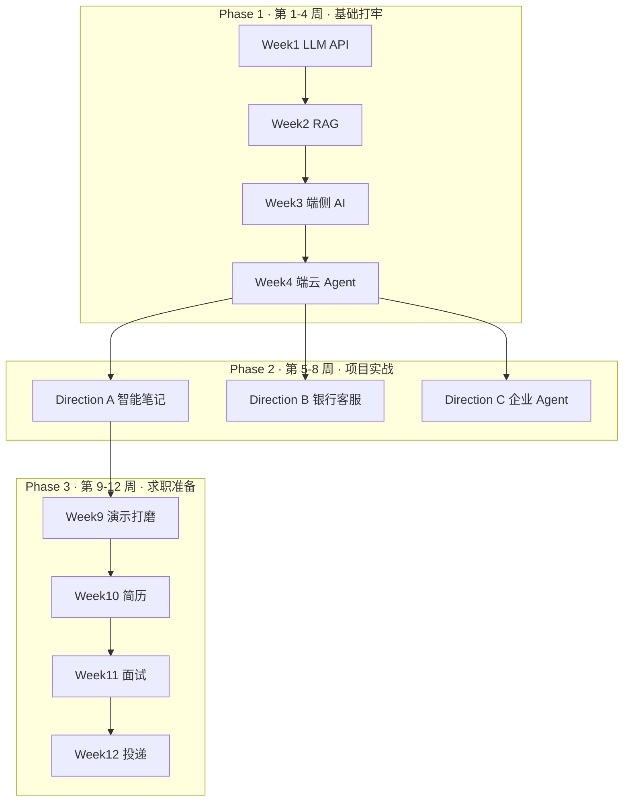

# AI 应用开发学习路线

> **从 Android 开发者转型 AI 应用开发者**  
> 仓库：https://github.com/Afra55/ai-app-dev-roadmap

这是一份 **12 周、可运行代码 + 分步教程** 的系统化学习路线。  
每个阶段有明确目标，每一周有具体任务、产出物和验收方式——按周推进即可，不需要自己猜「这周该干什么」。

---

## 目录

- [我是谁？该从哪开始？](#我是谁该从哪开始)
- [12 周总览](#12-周总览)
- [快速开始（30 分钟）](#快速开始30-分钟)
- [第一阶段：基础打牢（第 1–4 周）](#第一阶段基础打牢第-14-周)
- [第二阶段：项目实战（第 5–8 周）](#第二阶段项目实战第-58-周)
- [第三阶段：求职准备（第 9–12 周）](#第三阶段求职准备第-912-周)
- [每周学习节奏（推荐）](#每周学习节奏推荐)
- [作品集与演示](#作品集与演示)
- [仓库结构](#仓库结构)
- [常见问题](#常见问题)

---

## 我是谁？该从哪开始？

| 你的背景 | 建议 |
|----------|------|
| 有 Android 开发经验，没写过 Python AI | 从 [Week 1](#week-1python--prompt--deepseek-api) 开始，按顺序走完 Phase 1 |
| 会 Python，没做过 RAG / Agent | 可从 [Week 2](#week-2rag-本地文档问答) 快速过一遍，重点 Week 4 |
| 已完成 Phase 1，准备做项目 | 进入 [Phase 2](#第二阶段项目实战第-58-周)，主攻 Direction A |
| 项目做完，准备求职 | 进入 [Phase 3](#第三阶段求职准备第-912-周)，从 Week 9 演示打磨开始 |

**第一次打开仓库？** 执行下方 [快速开始](#快速开始30-分钟)，跑通 Week 1 聊天 Demo，再按周推进。

---

## 12 周总览



| 阶段 | 周次 | 你要达成什么 | 阶段导航 |
|------|------|--------------|----------|
| **Phase 1** 基础打牢 | 1–4 | 能独立调用 LLM、搭建 RAG、理解端侧 AI、实现端云协同 Agent | [phase1/README.md](phase1/README.md) |
| **Phase 2** 项目实战 | 5–8 | 做出 1 个可演示的 Portfolio 项目（三方向选一主攻） | [phase2/README.md](phase2/README.md) |
| **Phase 3** 求职准备 | 9–12 | 简历、面试题、演示录屏、投递材料全部就绪 | [phase3/README.md](phase3/README.md) |

---

## 快速开始（30 分钟）

```bash
git clone https://github.com/Afra55/ai-app-dev-roadmap.git
cd ai-app-dev-roadmap

pip install -e ".[dev]"                    # ① 安装全仓库依赖
cp .env.example phase1/week1/.env          # ② 可选：配置 API Key（无 Key 可走 Mock）
bash scripts/check_portfolio.sh            # ③ 一键检查各周是否可运行
```

**第一次体验**（有 API Key 效果更好，没有也能跑部分 Demo）：

```bash
cd phase1/week1 && python demo_chat.py     # 结构化输出聊天
cd ../week2 && python demo_rag.py "什么是 RAG？"   # 本地文档问答
cd ../week3 && python chat_local.py        # 端侧 Mock 聊天（无需 Key）
cd ../week4 && python app.py               # 端云路由 + Agent
```

---

## 第一阶段：基础打牢（第 1–4 周）

> **阶段目标**：掌握 AI 应用开发的四大基础能力——LLM 调用、RAG 检索、端侧推理、端云协同 Agent。  
> **完成后**：有能力阅读和扩展 Phase 2 的项目代码。

阶段详情：[phase1/README.md](phase1/README.md)

---

### Week 1：Python + Prompt + DeepSeek API

| 项目 | 内容 |
|------|------|
| **本周聚焦** | Python 环境、Prompt 工程、DeepSeek API 调用、结构化输出 |
| **你要做的事** | ① 配环境 + API Key → ② 跑结构化聊天 Demo → ③ 写带历史的完整应用 → ④ 体验 Tool Use |
| **核心产出** | 可运行的聊天应用；`common/llm_utils.py` 的统一 LLM 封装 |
| **关键文件** | `demo_chat.py` · `app.py` · `app_with_tool.py` |
| **验收** | `python phase1/week1/verify_setup.py` |
| **详细教程** | [phase1/week1/README.md](phase1/week1/README.md) |

```bash
cd phase1/week1
pip install -r requirements.txt
cp .env.example .env    # 填入 DEEPSEEK_API_KEY
python demo_chat.py
```

---

### Week 2：RAG 本地文档问答

| 项目 | 内容 |
|------|------|
| **本周聚焦** | 文档加载 → 分块 → Embedding → Chroma 向量库 → 检索增强生成 |
| **你要做的事** | ① 索引 `sample_docs/` → ② 命令行问答 → ③ 调 chunk 参数观察效果 → ④ 启动 FastAPI 服务 |
| **核心产出** | 本地文档问答工具 + HTTP API（端口 `8000`） |
| **关键文件** | `ingest.py` · `rag_pipeline.py` · `demo_rag.py` · `api.py` |
| **验收** | `python phase1/week2/verify_setup.py`（会自动构建示例索引） |
| **详细教程** | [phase1/week2/README.md](phase1/week2/README.md) |

```bash
cd phase1/week2
python ingest.py --reindex
python demo_rag.py "Android 开发者有什么优势？"
uvicorn api:app --reload --port 8000
```

---

### Week 3：安卓端侧 AI

| 项目 | 内容 |
|------|------|
| **本周聚焦** | 端侧 AI 场景、Mock/本地小模型、Android 聊天 App 骨架 |
| **你要做的事** | ① Python Mock 端侧聊天 → ② 可选：Qwen2.5 本地推理 → ③ Android Studio 打开 `android-app/` |
| **核心产出** | `OnDeviceLLM` 抽象 + Jetpack Compose 聊天界面骨架 |
| **关键文件** | `local_llm.py` · `chat_local.py` · `android-app/` |
| **验收** | `python phase1/week3/verify_setup.py`（无需 API Key） |
| **详细教程** | [phase1/week3/README.md](phase1/week3/README.md) |

```bash
cd phase1/week3
python chat_local.py              # Mock 模式，开箱即用
python chat_local.py --backend qwen   # 可选：真实本地模型（需下载）
```

---

### Week 4：端云协同 + LangGraph Agent

| 项目 | 内容 |
|------|------|
| **本周聚焦** | 三路路由（local / cloud / agent）、LangGraph ReAct、工具调用 |
| **你要做的事** | ① 理解路由规则 → ② 测试天气/计算器/RAG 工具 → ③ 跑端云协同 Demo → ④ 改关键词观察路由变化 |
| **核心产出** | `EdgeCloudOrchestrator`：问候走端侧、复杂问题走云端、工具需求走 Agent |
| **关键文件** | `router.py` · `tools.py` · `agent.py` · `app.py` |
| **验收** | `python phase1/week4/verify_setup.py` |
| **详细教程** | [phase1/week4/README.md](phase1/week4/README.md) |

```bash
cd phase1/week4
python app.py
# 试试：「你好」→ local · 「分析架构」→ cloud · 「北京天气」→ agent
```

**Phase 1 完成标志**：`bash scripts/check_portfolio.sh` 中 Week 1–4 全部通过。

---

## 第二阶段：项目实战（第 5–8 周）

> **阶段目标**：把 Phase 1 的能力整合成一个**可写进简历、可现场演示**的完整项目。  
> **怎么选**：主攻一个方向（建议 A），另两个作辅助展示。

阶段详情：[phase2/README.md](phase2/README.md)

### 方向怎么选？

| 方向 | 适合岗位 | 完整度 | 技术亮点 |
|------|----------|--------|----------|
| **[A 智能笔记](phase2/direction-a-smart-notes/)** | AI 应用开发 / 端云协同 | 完整 | 笔记 RAG + 端云路由 + Android |
| **[B 银行客服](phase2/direction-b-bank-assistant/)** | 银行 Android + 安全合规 | 精简 MVP | FAQ RAG + 敏感信息脱敏 |
| **[C 企业 Agent](phase2/direction-c-enterprise-agent/)** | 国企 Agent / Python 全栈 | 精简 MVP | 部门权限 + LangGraph + 审计日志 |

### 第 5–8 周每周做什么？（以 Direction A 为例）

| 周次 | 本周任务 | 产出物 | 验收 |
|------|----------|--------|------|
| **Week 5** | 笔记 CRUD（SQLite）+ 保存时自动向量索引 | 笔记库 + Chroma 索引 | `POST /notes` 后可检索 |
| **Week 6** | 接入 Week 4 端云路由 + 「问我的笔记」RAG 问答 | `/chat` 接口，含 route 字段 | 「你好」→ local；笔记问题 → notes-rag |
| **Week 7** | Android 客户端联调（Compose UI + 后端 API） | 可列出笔记、可提问的 App | 模拟器访问 `10.0.2.2:8010` |
| **Week 8** | 联调打磨、补 README、排练 5 分钟演示 | 完整 Portfolio 项目 | `python verify_setup.py` 通过 |

**Direction B / C 的周次映射**见 [phase2/README.md](phase2/README.md#周次与项目映射)。

### 快速启动（Direction A）

```bash
cd phase2/direction-a-smart-notes
pip install -r requirements.txt
python verify_setup.py
uvicorn api:app --reload --port 8010
# API 文档：http://127.0.0.1:8010/docs
```

| 方向 | 目录 | 教程 | 端口 |
|------|------|------|------|
| A | [phase2/direction-a-smart-notes/](phase2/direction-a-smart-notes/) | [README](phase2/direction-a-smart-notes/README.md) | `8010` |
| B | [phase2/direction-b-bank-assistant/](phase2/direction-b-bank-assistant/) | [README](phase2/direction-b-bank-assistant/README.md) | `8020` |
| C | [phase2/direction-c-enterprise-agent/](phase2/direction-c-enterprise-agent/) | [README](phase2/direction-c-enterprise-agent/README.md) | `8030` |

**Phase 2 完成标志**：主项目 `verify_setup.py` 通过 + 能 5 分钟内演示核心流程。

---

## 第三阶段：求职准备（第 9–12 周）

> **阶段目标**：把代码变成**求职资产**——能演示、能写进简历、能答面试追问。  
> **本阶段不再写大项目**，聚焦包装与投递。

阶段详情：[phase3/README.md](phase3/README.md)

| 周次 | 本周聚焦 | 你要做的事 | 核心产出 |
|------|----------|------------|----------|
| **[Week 9](phase3/week9-portfolio/)** | Portfolio 打磨 | 跑演示脚本、练 5 分钟口述、准备录屏 | 演示脚本熟练、项目亮点文档 |
| **[Week 10](phase3/week10-resume/)** | 简历优化 | 按模板写项目 bullet、技能自评、删冗余 | 中英文简历各一版 |
| **[Week 11](phase3/week11-interview/)** | 面试准备 | 过 RAG/Agent/端云/Android 问答、模拟面试 | 能答各 3 个追问 |
| **[Week 12](phase3/week12-apply/)** | 投递收尾 | JD 匹配、GitHub 检查、建立投递跟踪表 | 至少 5 份定制简历投递 |

### Week 9–12 每周入口

| 周次 | 教程 | 关键材料 |
|------|------|----------|
| 9 | [week9-portfolio/README.md](phase3/week9-portfolio/README.md) | [演示清单](phase3/week9-portfolio/demo-checklist.md) · [项目亮点](phase3/week9-portfolio/project-highlights.md) |
| 10 | [week10-resume/README.md](phase3/week10-resume/README.md) | [简历模板（中文）](phase3/week10-resume/resume-template-zh.md) · [bullet 范例](phase3/week10-resume/bullet-examples.md) |
| 11 | [week11-interview/README.md](phase3/week11-interview/README.md) | [RAG/Agent 问答](phase3/week11-interview/rag-agent-qa.md) · [端云协同](phase3/week11-interview/edge-cloud-qa.md) |
| 12 | [week12-apply/README.md](phase3/week12-apply/README.md) | [投递跟踪表](phase3/week12-apply/tracking-template.md) · [GitHub 检查](phase3/week12-apply/github-profile-checklist.md) |

**Phase 3 完成标志**：[阶段验收清单](phase3/README.md#阶段验收清单) 全部打勾。

---

## 每周学习节奏（推荐）

每周建议投入 **8–12 小时**，按以下节奏推进：

```
周一～周二   阅读当周 README「学习目标」+ 跑通 verify_setup
周三～周四   按 Step 完成核心代码练习
周五         做 README 末尾的练习 / 改参数实验
周末         写学习笔记 + 提交代码 + 跑 check_portfolio.sh
```

**每周结束前确认**：

- [ ] `verify_setup.py` 通过
- [ ] 能用自己的话解释「这周学了什么」
- [ ] 能演示至少 1 个可运行 Demo
- [ ] （Week 4 起）理解本周代码如何被 Phase 2 项目复用

---

## 作品集与演示

| 项目 | 亮点 | 一键演示 |
|------|------|----------|
| [Direction A 智能笔记](phase2/direction-a-smart-notes/) | 端云协同 + 笔记 RAG + Android | `bash phase3/week9-portfolio/demo-scripts/direction-a-demo.sh` |
| [Direction B 银行客服](phase2/direction-b-bank-assistant/) | 金融脱敏 + FAQ RAG | `bash phase3/week9-portfolio/demo-scripts/direction-b-demo.sh` |
| [Direction C 企业 Agent](phase2/direction-c-enterprise-agent/) | 部门权限 + 审计日志 | `bash phase3/week9-portfolio/demo-scripts/direction-c-demo.sh` |

全量检查：`bash scripts/check_portfolio.sh`（含 pytest + 各周冒烟测试）

架构说明：[docs/ARCHITECTURE.md](docs/ARCHITECTURE.md) · 贡献指南：[CONTRIBUTING.md](CONTRIBUTING.md)

---

## 仓库结构

```
ai-app-dev-roadmap/
├── README.md                 # ← 你正在看的总路线图
├── common/                   # 跨周复用：LLM、RAG、Embedding
├── phase1/                   # 第 1–4 周：week1/ week2/ week3/ week4/
├── phase2/                   # 第 5–8 周：direction-a/ b/ c/
├── phase3/                   # 第 9–12 周：简历、面试、投递
├── tests/                    # pytest 回归
└── scripts/check_portfolio.sh
```

---

## 常见问题

**没有 DeepSeek API Key 能学吗？**  
可以。Week 1/2/4 的 cloud 路径需要 Key，但 Week 3 Mock、Week 4 端侧路由、Week 2 检索、Phase 2 离线模式均可无 Key 运行。

**每周都要新建虚拟环境吗？**  
不必须。推荐在仓库根目录 `pip install -e ".[dev]"` 一次装齐；各周 `requirements.txt` 作参考。

**Phase 2 必须三个项目都做吗？**  
不必。主攻 1 个（建议 A），另 2 个了解结构即可，面试时作辅助谈资。

**代码看不懂怎么办？**  
先跑通 Demo → 读当周 README 的「代码说明」→ 对照 `docs/ARCHITECTURE.md` 看模块关系 → 在 Issue 提问。

---

## 推荐资源

- [Datawhale《动手学大模型应用开发》](https://github.com/datawhalechina/llm-universe)
- [Google AI Edge / LiteRT](https://ai.google.dev/edge)
- [LangGraph 官方教程](https://langchain-ai.github.io/langgraph/)
- [DeepSeek API 文档](https://api-docs.deepseek.com/)

**建议跳过**：大模型训练、数学推导、CUDA 底层优化——前 3 个月聚焦**应用开发**。

---

**最后更新**：2026 年 7 月 · 问题反馈请提交 [Issue](https://github.com/Afra55/ai-app-dev-roadmap/issues)
