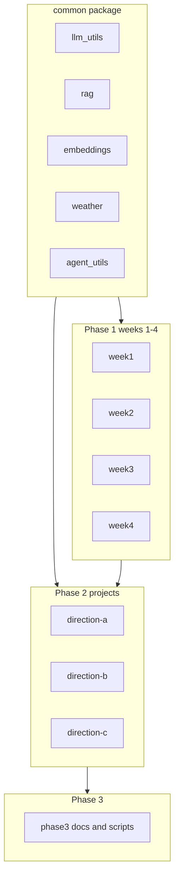

# Architecture

## Overview

`ai-app-dev-roadmap` is a **teaching monorepo** for Android developers learning AI application development over 12 weeks.



## Package layout

| Path | Role |
|------|------|
| `common/` | Shared LLM, RAG, embeddings, weather, agent utilities |
| `week1/` | LLM API, Prompt, Tool Use demos |
| `week2/` | RAG pipeline + FastAPI |
| `week3/` | On-device LLM abstraction + Android skeleton |
| `week4/` | Edge-cloud router + LangGraph Agent |
| `projects/` | Portfolio apps (weeks 5–8) |
| `phase3/` | Resume, interview, apply materials (weeks 9–12) |
| `tests/` | Pytest regression suite |
| `scripts/` | Portfolio verification scripts |

## Import convention

After `pip install -e ".[dev]"` from repository root:

```python
from common.llm_utils import get_llm, get_cloud_llm
from common.rag import load_documents, build_vectorstore
```

Weekly modules may keep thin wrappers for backward compatibility.

## Data flow (Direction A — reference integration)

1. Note saved to SQLite (`database.py`)
2. Note chunks indexed to Chroma (`indexer.py` → `common.rag`)
3. User question → `chat_service.py`
4. If note-related → notes RAG via `get_cloud_llm` (offline fallback without API key)
5. Else → `week4.EdgeCloudOrchestrator` (local / cloud / agent)

## Ports

| Service | Port |
|---------|------|
| Week 2 API | 8000 |
| Week 4 Gradio | 7860 (default) |
| Direction A | 8010 |
| Direction B | 8020 |
| Direction C | 8030 |

## Design principles

1. **Runnable without API key** — Mock / offline paths for demos and CI
2. **Single shared library** — avoid copy-paste across weeks
3. **Verify scripts** — every module has `verify_setup.py`
4. **Teaching first** — not production MLOps; clarity over scale
