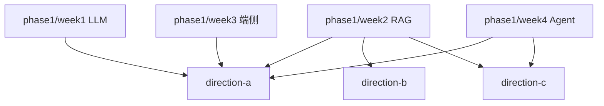

# 第二阶段：项目实战（第 5–8 周）

**时间**：第 5–8 周  
**目标**：将第一阶段能力整合为可演示的 Portfolio 项目，按目标岗位选择主攻方向。

← [路线图](../README.md) · [第一阶段](../phase1/) · **Phase 2**

---

## 方向选择

| 方向 | 目录 | 完整度 | 适合岗位 |
|------|------|--------|----------|
| **A** | [direction-a-smart-notes/](direction-a-smart-notes/) | 完整 | AI 应用开发 / 端云协同 |
| **B** | [direction-b-bank-assistant/](direction-b-bank-assistant/) | 精简 MVP | 银行 Android 开发 |
| **C** | [direction-c-enterprise-agent/](direction-c-enterprise-agent/) | 精简 MVP | 国企 Agent 应用开发 |

---

## 周次与项目映射

| 周次 | 方向 A | 方向 B | 方向 C |
|------|--------|--------|--------|
| 5 | 笔记 CRUD + 向量索引 | FAQ 知识库 + 脱敏 | 部门知识库 + 权限 |
| 6 | 端云路由 + RAG 问答 | FastAPI 客服 API | LangGraph Agent 工具链 |
| 7 | Android 客户端联调 | Android 安全 UI | Streamlit 管理台 |
| 8 | 联调打磨 + README | 联调打磨 + README | 审计日志 + README |

---

## 项目入口

| 方向 | 代码目录 | 学习指南 | 端口 |
|------|----------|----------|------|
| A 智能笔记 | [direction-a-smart-notes/](direction-a-smart-notes/) | [README](direction-a-smart-notes/README.md) | `8010` |
| B 银行客服 | [direction-b-bank-assistant/](direction-b-bank-assistant/) | [README](direction-b-bank-assistant/README.md) | `8020` |
| C 企业 Agent | [direction-c-enterprise-agent/](direction-c-enterprise-agent/) | [README](direction-c-enterprise-agent/README.md) | `8030` |

---

## 推荐学习路径

1. **主攻 Direction A**（智能笔记）——覆盖 RAG + 端云 + Android
2. 用 Direction B 展示安全合规意识（Android 面试）
3. 用 Direction C 展示 Agent 工作流（后端/国企岗）

---

## 一键验证

```bash
pip install -e ".[dev]"
bash scripts/check_portfolio.sh
```

单独检查：

```bash
python phase2/direction-a-smart-notes/verify_setup.py
python phase2/direction-b-bank-assistant/backend/verify_setup.py
python phase2/direction-c-enterprise-agent/verify_setup.py
```

共享 RAG / LLM 逻辑见 [common/](../common/) 与 [docs/ARCHITECTURE.md](../docs/ARCHITECTURE.md)。

---

## 与第一阶段的关系



---

## 完成后

进入 [第三阶段（第 9–12 周）](../phase3/) 打磨求职材料。
