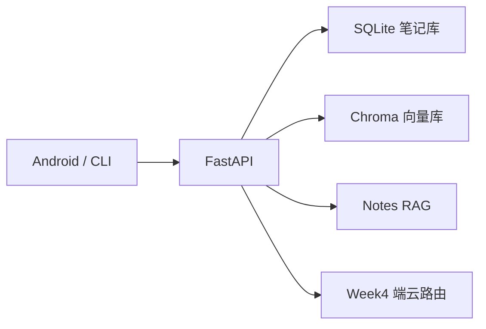

# 智能笔记 App（Direction A）

← [路线图](../../README.md) · [第二阶段](../README.md) · **Direction A**

端云协同智能笔记项目，整合第一阶段 Week 2 RAG、Week 3 端侧模型、Week 4 端云路由。

## 功能

- 笔记 CRUD（SQLite）
- 保存笔记时自动向量索引
- 「问我的笔记」RAG 问答
- 简单问候走端侧 Mock，复杂问题走云端/Agent

## 快速开始

```bash
cd phase2/direction-a-smart-notes
pip install -r requirements.txt
python verify_setup.py
python demo_cli.py --init
python demo_cli.py "我的 RAG 笔记说了什么"
uvicorn api:app --reload --port 8010
```

API 文档：http://127.0.0.1:8010/docs

## Android App

1. 启动后端：`uvicorn api:app --host 0.0.0.0 --port 8010`
2. Android Studio 打开 `android-app/`（需 JDK 17+）
3. 模拟器访问宿主机：`http://10.0.2.2:8010`（已在 `BuildConfig.API_BASE_URL` 配置）

**离线兜底**：后端未启动时，问候语（如「你好」）由端侧 Mock 本地回复，与 Week 3 `MockLocalLLM` 行为一致（见 `NotesRepository.kt`）。

```bash
# 可选：命令行验证端侧路由（无需 API Key）
python verify_setup.py
```

## 架构



## 验收清单

- [ ] `python verify_setup.py` 通过
- [ ] `POST /notes` 创建笔记后可被 `/chat` 检索
- [ ] 「你好」走 local 路由
- [ ] 笔记相关问题返回 sources
- [ ] Android App 可列出笔记并提问
- [ ] 后端关闭时输入「你好」仍能得到端侧 Mock 回复
