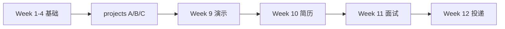

# 第三阶段：Portfolio 打磨 + 简历 + 面试 + 投递

**时间**：第 9–12 周  
**目标**：把 `week1–4` 和 `projects/` 变成可演示、可写进简历、可答追问的求职资产。

---

## 本阶段不做什么

- 不再新增大型项目（除非面试前发现明显缺口）
- 不深入大模型训练、数学推导
- 不堆砌与岗位无关的八股文

---

## 四周路线

| 周次 | 主题 | 目录 | 核心产出 |
|------|------|------|----------|
| 9 | Portfolio 打磨 | [week9-portfolio](week9-portfolio/) | 演示脚本、项目亮点、录屏清单 |
| 10 | 简历优化 | [week10-resume](week10-resume/) | 简历模板、项目 bullet 范例、技能自评 |
| 11 | 面试准备 | [week11-interview](week11-interview/) | 技术问答、系统设计、模拟面试 |
| 12 | 投递收尾 | [week12-apply](week12-apply/) | JD 匹配、GitHub 检查、投递记录 |

---

## 一键检查作品集可运行性

```bash
bash scripts/check_portfolio.sh
```

---

## 推荐学习顺序

1. **先主攻一个岗位方向**（建议 Direction A 智能笔记）
2. Week 9：把主项目演示练到 5 分钟内流畅讲完
3. Week 10：按模板改简历，只保留 1 主 + 1 辅项目
4. Week 11：按目标岗位选读面试题（AI 应用 / 银行 Android / 国企 Agent）
5. Week 12：定制化投递，记录反馈并回补薄弱点

---

## 与前期内容的对应关系



---

## 阶段验收清单

- [ ] 能在 5 分钟内演示主项目（含离线可跑部分）
- [ ] 简历主项目描述可在 30 秒内口述清楚
- [ ] 能回答 RAG / Agent / 端云协同各 3 个追问
- [ ] GitHub 仓库无密钥泄露，`verify_setup` 可通过
- [ ] 完成至少 5 份针对岗位的简历微调版本
- [ ] 建立投递跟踪表并记录面试反馈

---

**最后更新**：2026 年 7 月
