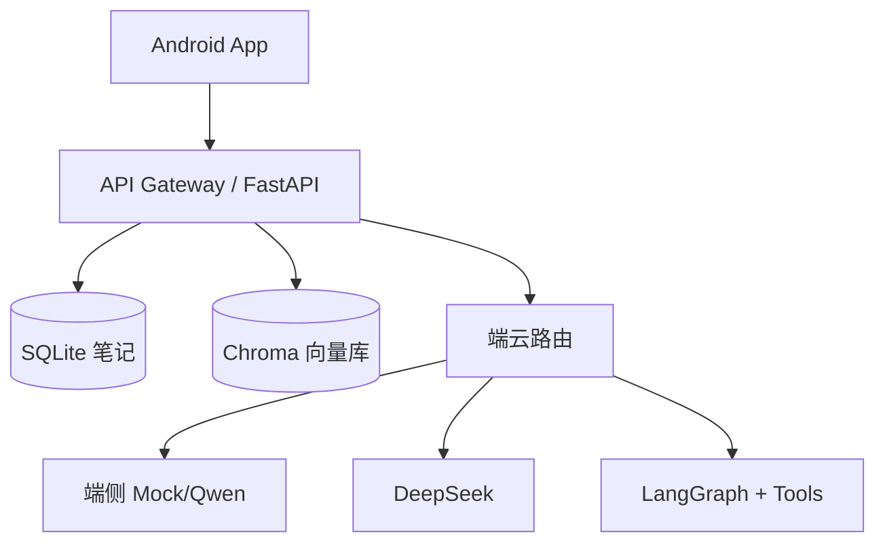

# 系统设计（轻量版）

基于本仓库已有项目，练习 **15–20 分钟白板题**。无需标准答案，重点展示思路。

---

## 题目 A：设计端云协同智能笔记

### 需求澄清（先问）

- 用户规模？笔记是否私密？是否离线优先？
- 是否需要多设备同步？

### 参考架构

### 核心流程

1. 写笔记 → 持久化 → 异步/同步索引
2. 提问 → 判断是否笔记相关 → RAG 检索 → 可选端云路由
3. 返回答案 + 来源

### 权衡

| 决策 | 选项 | 本仓库选择 |
|------|------|------------|
| 向量库 | 本地 Chroma / 云端 Pinecone | 本地 Chroma（学习/原型） |
| 路由 | 规则 / 模型分类 | 规则（可解释） |
| 同步 | 仅本地 / 云同步 | 仅本地 API |

### 风险

- 索引与笔记不一致 → 保存时触发 `index_note`
- Key 泄露 → 仅后端
- 检索空 → Prompt 约束 + 明确提示

---

## 题目 B：设计银行智能客服 App

### 需求澄清

- 是否真人客服兜底？监管对日志要求？
- 知识库更新频率？

### 参考要点

- 客户端：FAQ 快捷入口 + 自由问答 + 转人工按钮
- 后端：RAG + 脱敏 + 鉴权（Token）
- **无 Key 在 App**

### 安全清单

- [ ] TLS
- [ ] 日志脱敏
- [ ] 速率限制（可口述）
- [ ] 敏感操作不走 LLM 自动执行

---

## 题目 C：设计企业内部 Agent

### 需求澄清

- 部门权限如何隔离？
- 是否需要审批流？

### 参考要点

- 分部门知识库 metadata
- LangGraph：意图 → 检索 → 工具 → 审计
- Human-in-the-loop（工单/审批可扩展）

### 审计字段

`user_id`, `question`, `route`, `tools`, `created_at` — 见 `direction-c/audit.py`。

---

## 答题时间分配（20 分钟）

| 阶段 | 时间 |
|------|------|
| 澄清需求 | 3 min |
| 画架构 | 5 min |
| 讲核心流程 | 7 min |
| 风险与扩展 | 5 min |

---

## 自测

选一道题，录音 15 分钟讲完，回放检查是否：
- [ ] 先问需求而非直接给方案
- [ ] 能对应到本仓库具体模块
- [ ] 提到 1–2 个 trade-off
