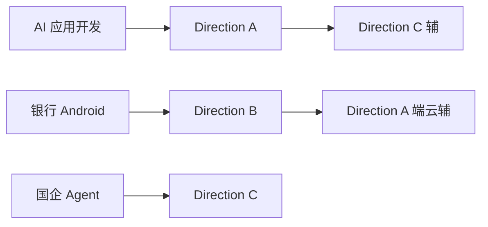

# 岗位匹配与投递策略

---

## JD 关键词 → 简历侧重

| JD 关键词 | 简历主打 | 演示项目 | 面试重点 |
|-----------|----------|----------|----------|
| RAG / 知识库 / 大模型应用 | Direction A + Week2 | 笔记 RAG + 来源 | rag-agent-qa |
| Android / 移动端 / Kotlin | Direction A/B Android | App + 后端 | android-ai-qa |
| Agent / LangGraph / 智能体 | Direction C + Week4 | 企业助手 + 工具 | rag-agent-qa Agent 部分 |
| 金融 / 银行 / 合规 | Direction B | 脱敏 + 无 Key 客户端 | android-ai-qa 安全 |
| 国企 / 信息化 / 审计 | Direction C | 分部门 KB + audit | system-design C |

---

## 三方向与岗位映射

---

## 简历版本管理

建议维护 3 个 PDF 版本（内容 80% 相同）：

| 版本 | 主项目 | 技能区排序 |
|------|--------|------------|
| `resume-ai-app.pdf` | A | Python / RAG / Agent 在前 |
| `resume-bank-android.pdf` | B | Android / 安全 在前 |
| `resume-enterprise-agent.pdf` | C | Agent / 知识库 在前 |

---

## 公司调研清单（每家 10 分钟）

- [ ] 业务是否用大模型 / 知识库 / 移动端 AI？
- [ ] 技术栈偏 Python 还是 Android？
- [ ] 国企/银行是否重合规、审计？
- [ ] 岗位更偏研发还是解决方案？

---

## 投递渠道

| 渠道 | 说明 |
|------|------|
| 官网 / 内推 | 优先，回复率更高 |
| Boss / 猎聘 / 智联 | 注意 JD 真实性 |
| 国企官网 | 周期 long，提前投递 |
| GitHub / 技术社区 | 展示仓库与 Demo 链接 |

---

## 避免事项

- 海投同一版简历到差异很大的岗位
- 简历项目与 GitHub 仓库对不上
- 面试时演示从未跑过的命令
- 对银行/金融项目不说明「教学演示」性质

---

## 目标数量（可调整）

| 指标 | 建议 |
|------|------|
| 目标公司调研 | 10–20 家 |
| 第一周投递 | 5–10 份 |
| 定制简历版本 | 3 版 |
| 模拟面试 | ≥2 次 |
