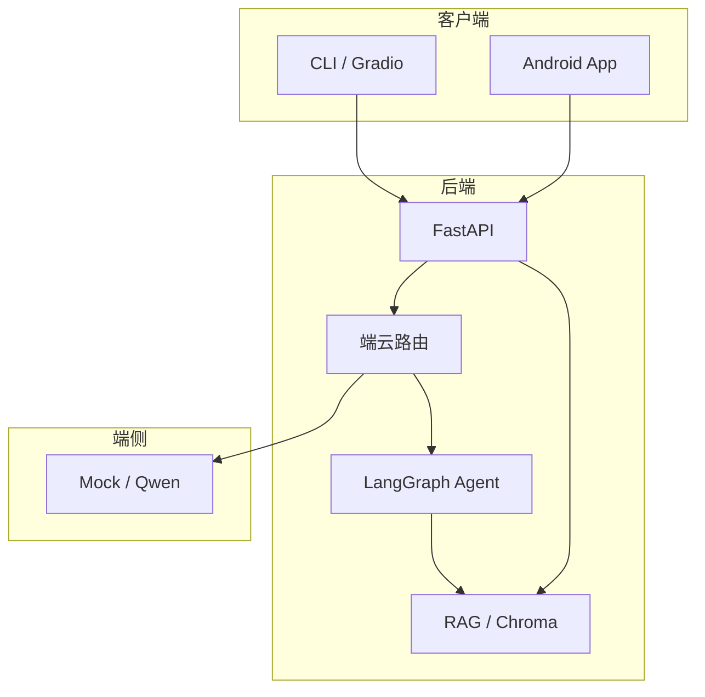

# 三方向项目亮点提炼

用于简历、面试自我介绍和 Portfolio 首页。每个方向选 **1 个主项目** 深挖即可。

---

## Direction A：端云协同智能笔记（推荐主攻）

### 一句话

> 笔记自动索引 + RAG 问答，简单交互走端侧，复杂推理与工具任务走云端 Agent。

### 问题背景

- 用户笔记分散，传统搜索只能关键词匹配
- 全量上云有隐私和成本问题

### 技术方案

| 模块 | 实现 | 对应仓库 |
|------|------|----------|
| 笔记存储 | SQLite CRUD | `phase2/direction-a-smart-notes/database.py` |
| 自动索引 | 保存时写入 Chroma | `indexer.py` |
| 笔记问答 | RAG Prompt + 来源引用 | `chat_service.py` |
| 端云路由 | local / cloud / agent | 复用 `phase1/week4/agent.py` |
| 客户端 | Android Compose + Retrofit | `android-app/` |

### 可量化表述（按实际填写）

- 支持 txt/md 笔记自动分块索引
- 问答返回答案 + 来源（note-id / 标题）
- 离线模式：端侧 Mock + 检索片段降级

### 面试可讲难点

1. 笔记更新后如何增量重建索引？
2. 端云路由规则如何设计、如何可观测？
3. Android 如何安全调用后端（Key 不进客户端）？

---

## Direction B：银行智能客服（精简 MVP）

### 一句话

> 教学演示版银行 FAQ 智能客服，强调 **API Key 后端托管** 与 **输入脱敏**。

### 问题背景

- 客服重复回答产品/policy 类问题
- 金融场景对隐私和合规要求高

### 技术方案

| 模块 | 实现 |
|------|------|
| 知识库 | FAQ 文档 RAG |
| 安全 | 手机号/身份证脱敏 `security.py` |
| 客户端 | 快捷问题 + 聊天，无 Key |

### 面试话术（务必说明）

> 本项目为**教学演示**，数据与业务均为虚构，用于展示 Android + RAG + 安全意识的工程实践。

### 可强调亮点

- 客户端零密钥
- 日志脱敏
- 弱网时友好错误提示

---

## Direction C：企业内部智能助手（精简 MVP）

### 一句话

> 分部门知识库 + LangGraph Agent + 审计日志，支持 HR/财务/IT 场景问答与 Mock 工具调用。

### 问题背景

- 企业制度文档多、部门边界清晰
- 需要可追溯的问答审计

### 技术方案

| 模块 | 实现 |
|------|------|
| 知识库 | 按 department 分目录索引 |
| Agent | ReAct + 知识库/请假/工单工具 |
| 审计 | SQLite `audit_logs` |
| 管理界面 | Gradio `app_admin.py` |

### 可强调亮点

- 多工具协作（不是单轮 Chat）
- 离线降级：无 API Key 时走 RAG 片段模式
- 审计日志可对接合规要求

---

## 如何在简历里选项目

| 目标岗位 | 主项目 | 辅项目 |
|----------|--------|--------|
| AI 应用开发 | A | C |
| 银行 Android | B | A（端云部分） |
| 国企 Agent | C | A 或 Week4 |

---

## 架构图（面试白板可画）

