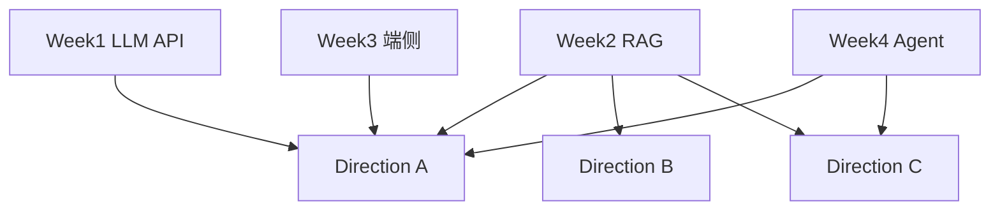

# 第二阶段：分方向项目实战

本目录包含三个求职方向的项目实现，衔接第一阶段 Week 1-4 的基础能力。

## 方向选择

| 方向 | 目录 | 完整度 | 适合岗位 |
|------|------|--------|----------|
| **A** | [direction-a-smart-notes](direction-a-smart-notes/) | 完整 | AI 应用开发 / 端云协同 |
| **B** | [direction-b-bank-assistant](direction-b-bank-assistant/) | 精简 MVP | 银行 Android 开发 |
| **C** | [direction-c-enterprise-agent](direction-c-enterprise-agent/) | 精简 MVP | 国企 Agent 应用开发 |

## 推荐学习路径

1. **主攻 Direction A**（智能笔记）——覆盖 RAG + 端云 + Android
2. 用 Direction B 展示安全合规意识（Android 面试）
3. 用 Direction C 展示 Agent 工作流（后端/国企岗）

## 一键验证

```bash
# Direction A
cd direction-a-smart-notes && pip install -r requirements.txt && python verify_setup.py

# Direction B
cd ../direction-b-bank-assistant/backend && pip install -r requirements.txt && python verify_setup.py

# Direction C
cd ../../direction-c-enterprise-agent && pip install -r requirements.txt && python verify_setup.py
```

## 服务端口

| 项目 | 默认端口 |
|------|----------|
| Direction A | 8010 |
| Direction B | 8020 |
| Direction C | 8030 |

## 与第一阶段的关系



## 第三阶段（第 9-12 周）

Portfolio、简历、面试与投递详见 [`phase3/`](../phase3/)。

```bash
# 仓库根目录执行
bash scripts/check_portfolio.sh
```
