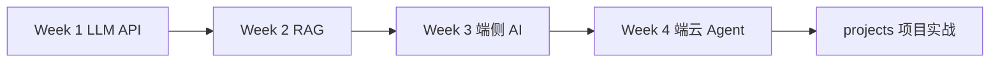

# 第一阶段：基础打牢（第 1–4 周）

**时间**：第 1–4 周  
**目标**：掌握 LLM API、RAG、端侧 AI 与端云协同 Agent，为第二阶段项目实战打基础。

---

## 四周路线

| 周次 | 主题 | 代码目录 | 学习指南 | 核心产出 |
|------|------|----------|----------|----------|
| 1 | Python + Prompt + DeepSeek API | [week1/](../week1/) | [README](../week1/README.md) | 结构化输出聊天应用 |
| 2 | RAG 本地文档问答 | [week2/](../week2/) | [README](../week2/README.md) | 向量检索 + FastAPI |
| 3 | 安卓端侧 AI | [week3/](../week3/) | [README](../week3/README.md) | Mock/Qwen 端侧 + Android 骨架 |
| 4 | 端云协同 + LangGraph Agent | [week4/](../week4/) | [README](../week4/README.md) | ReAct Agent + 三路路由 |

---

## 推荐学习顺序

按周次顺序推进，每周完成对应 `README.md` 中的任务清单后再进入下一周。



---

## 一键验证

```bash
# 仓库根目录
pip install -e ".[dev]"
bash scripts/check_portfolio.sh
```

单独检查某一周：

```bash
python week1/verify_setup.py
python week2/verify_setup.py
python week3/verify_setup.py
python week4/verify_setup.py
```

---

## 共享能力（后续周次会复用）

| 模块 | 路径 | 说明 |
|------|------|------|
| LLM 客户端 | [common/llm_utils.py](../common/llm_utils.py) | 源自 Week 1 |
| RAG 索引 | [common/rag.py](../common/rag.py) | 源自 Week 2 |
| Embedding | [common/embeddings.py](../common/embeddings.py) | 源自 Week 2 |
| 端云路由 | [week4/router.py](../week4/router.py) | Week 4 |
| Agent 工具 | [week4/tools.py](../week4/tools.py) | Week 4 |

架构总览见 [docs/ARCHITECTURE.md](../docs/ARCHITECTURE.md)。

---

## 完成后

进入 [第二阶段：项目实战（第 5–8 周）](../week5-8/)，在 [projects/](../projects/) 中选择方向 A / B / C。
