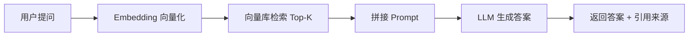

# 第2周：RAG 实现（本地文档问答 + FastAPI）

## 学习目标

完成本周学习后，你将能够：

- 解释 RAG 的完整流程和各环节作用
- 独立完成文档加载、分块、向量化与入库
- 使用 Chroma 实现相似度检索
- 设计「仅依据上下文回答」的 RAG Prompt
- 用 FastAPI 将 RAG 封装为 HTTP 服务
- 理解 RAG 的常见失败模式（检索不准、chunk 过大、幻觉）

## 本周资源

- [Datawhale《动手学大模型应用开发》](https://github.com/datawhalechina/llm-universe)
- [LangChain RAG 教程](https://python.langchain.com/docs/tutorials/rag/)
- [Chroma 官方文档](https://docs.trychroma.com/)
- [FastAPI 官方教程](https://fastapi.tiangolo.com/tutorial/)

---

## 快速开始（推荐）

本目录已包含可直接运行的示例代码：

```text
week2/
├── .env.example          # API Key 配置模板
├── requirements.txt      # Python 依赖
├── config.py             # 路径与参数配置
├── llm_utils.py          # DeepSeek 调用封装
├── embeddings.py         # 本地 Embedding 模型
├── ingest.py             # 文档索引（Step 2-3）
├── rag_pipeline.py       # 检索 + 生成（Step 4-5）
├── test_rag.py           # 命令行问答
├── api.py                # FastAPI 服务（Step 6）
├── verify_setup.py       # 环境检查脚本
└── sample_docs/          # 示例文档
```

### 1. 进入目录并安装依赖

```bash
cd week2
python3 -m venv .venv
source .venv/bin/activate   # Windows: .venv\Scripts\activate
pip install -r requirements.txt
```

> 首次运行会下载 Embedding 模型 `BAAI/bge-small-zh-v1.5`（约几百 MB），请保持网络畅通。

### 2. 配置 API Key

```bash
cp .env.example .env
```

编辑 `.env`，填入 DeepSeek API Key。如果你已完成第 1 周并配置了 `week1/.env`，**可以直接复用，无需重复配置**。

### 3. 运行环境检查

```bash
python verify_setup.py
```

该脚本会：
- 检查依赖是否安装完整
- 自动索引 `sample_docs/` 示例文档
- 执行一次检索测试（无需 API Key）

### 4. 按步骤运行示例

```bash
python ingest.py --reindex     # 手动重建索引
python test_rag.py             # 命令行交互问答
python test_rag.py "什么是 RAG？"  # 单次提问
uvicorn api:app --reload --port 8000  # 启动 API 服务
```

API 文档：http://127.0.0.1:8000/docs

---

## RAG 是什么？

**RAG（Retrieval-Augmented Generation，检索增强生成）** 让大模型基于外部知识库回答问题，而不是只靠训练记忆。



对 Android 开发者的类比：

| Android 概念 | RAG 对应 |
|-------------|---------|
| Room 数据库 | Chroma 向量库 |
| 本地搜索 | 相似度检索 |
| Repository | `RAGPipeline` |
| 网络请求 | DeepSeek API 生成 |

---

## 详细步骤

### Step 1: 理解 RAG + 环境准备

**目标**：理解 RAG 解决什么问题，并完成环境搭建。

RAG 解决三类核心问题：
1. **减少幻觉**：要求模型仅根据检索到的资料回答
2. **知识可更新**：更新文档后重新索引即可
3. **支持私有数据**：企业内部文档可作为知识库

请按上方「快速开始」完成环境搭建。

---

### Step 2: 文档加载与分块（Chunking）

**目标**：将原始文档切分为适合检索的文本块。

**运行**：

```bash
python ingest.py --docs sample_docs/
```

**代码说明**（`ingest.py`）：

- 支持 `txt`、`md`、`pdf` 三种格式
- 使用 `RecursiveCharacterTextSplitter` 分块
- 默认 `chunk_size=500`，`chunk_overlap=80`

**为什么要分块？**

- 块太大：检索粒度粗，容易带入无关内容
- 块太小：上下文不完整，答案可能片面
- `chunk_overlap`：保持段落之间的语义连续性

**练习**：修改 `config.py` 中的 `CHUNK_SIZE`，重新索引后对比检索效果。

---

### Step 3: Embedding + 向量库（Chroma）

**目标**：将文本块向量化并存入本地向量数据库。

**关键文件**：
- `embeddings.py`：加载本地中文 Embedding 模型
- `ingest.py`：写入 Chroma 并持久化到 `chroma_db/`

**为什么用本地 Embedding？**

- 无需额外 API Key
- 适合学习与离线场景
- 中文效果较好的轻量模型：`BAAI/bge-small-zh-v1.5`

**验收**：

```bash
python ingest.py --reindex
# 输出：索引完成：2 个文档，N 个文本块
```

---

### Step 4: 检索 + 增强 Prompt

**目标**：根据用户问题检索相关文档，并构造 RAG Prompt。

**核心 Prompt 模板**（`rag_pipeline.py`）：

```text
你是文档问答助手。请仅根据以下参考资料回答用户问题。
如果资料中没有相关信息，请明确回答「资料中未找到相关信息」，不要编造。

参考资料：
{context}

用户问题：{question}
```

**检索参数**：
- `TOP_K = 4`：返回最相关的 4 个文本块
- 可在 `config.py` 中调整

**测试检索（无需 API Key）**：

```bash
python -c "from rag_pipeline import RAGPipeline; p=RAGPipeline(); docs=p.retrieve('什么是RAG'); print(docs[0].page_content[:200])"
```

---

### Step 5: 封装完整 RAG Pipeline

**目标**：将检索与生成封装为可复用的 `RAGPipeline` 类。

**运行**：

```bash
python test_rag.py
```

**功能**：
- 交互式问答
- 返回答案 + 来源引用（文件名、chunk_id、摘要）
- 支持单次提问：`python test_rag.py "Android 开发者有什么优势？"`

**输出示例**：

```json
{
  "answer": "...",
  "sources": [
    {
      "file": "android_notes.md",
      "chunk_id": 1,
      "snippet": "..."
    }
  ]
}
```

---

### Step 6: FastAPI 服务化

**目标**：将 RAG 封装为 HTTP API，便于后续 Agent 和移动端调用。

**启动**：

```bash
uvicorn api:app --reload --port 8000
```

**接口列表**：

| 接口 | 方法 | 作用 |
|------|------|------|
| `/health` | GET | 健康检查 |
| `/ask` | POST | 提问并返回答案 |
| `/ingest/reindex` | POST | 重建示例文档索引 |
| `/ingest/upload` | POST | 上传文档并重建索引 |

**调用示例**：

```bash
# 健康检查
curl http://127.0.0.1:8000/health

# 提问
curl -X POST http://127.0.0.1:8000/ask \
  -H "Content-Type: application/json" \
  -d '{"question": "什么是 RAG？"}'

# 重建索引
curl -X POST http://127.0.0.1:8000/ingest/reindex
```

**首次启动**：若向量库不存在，服务会自动索引 `sample_docs/`。

---

## 本周验收清单

- [ ] `python verify_setup.py` 通过
- [ ] `python ingest.py --reindex` 成功索引示例文档
- [ ] `python test_rag.py "什么是 RAG？"` 能返回合理答案
- [ ] 答案包含来源引用（文件名）
- [ ] 问文档外问题时，模型回答「资料中未找到相关信息」
- [ ] `uvicorn api:app --port 8000` 启动成功
- [ ] `POST /ask` 返回 JSON 格式正确
- [ ] 能口头解释 Embedding、Chunk、Top-K、RAG Prompt 的作用

---

## 常见问题

### 1. 首次运行很慢

Embedding 模型首次会下载到本地缓存，属于正常现象。完成后后续启动会快很多。

### 2. `未找到 DEEPSEEK_API_KEY`

- 在 `week2/.env` 或 `week1/.env` 中配置 Key
- 检索功能不依赖 API Key，只有生成回答需要

### 3. `向量库不存在`

先运行：

```bash
python ingest.py --reindex
```

### 4. 检索结果不准确

- 调小 `CHUNK_SIZE` 或 `TOP_K`
- 检查文档内容是否与问题相关
- 确认已 `--reindex` 最新文档

### 5. API 启动后 `/ingest/reindex` 失败

服务运行中重建索引时，请优先使用 API 提供的 `/ingest/reindex` 接口（已处理连接重置），不要手动删除正在被服务占用的 `chroma_db/` 目录。

### 6. Chroma telemetry 警告

若看到 `Failed to send telemetry event`，不影响功能，可忽略。

---

## 可选练习

1. 往 `sample_docs/` 添加你自己的笔记，重新索引后提问
2. 调整 `TOP_K` 和 `CHUNK_SIZE`，观察答案变化
3. 在 Swagger UI 上传自己的 PDF 文档测试 `/ingest/upload`
4. 修改 RAG Prompt，要求答案以 bullet list 格式输出

---

## 与后续周次的衔接

| 周次 | 衔接点 |
|------|--------|
| 第 3 周 | 对比云端 RAG 与端侧小模型的差异 |
| 第 4 周 | 将 RAG 封装为 Agent 的 Tool：`search_knowledge_base(query)` |
| 第 5-8 周 | 智能笔记 / 客服 / 企业助手项目复用本 RAG 骨架 |

---

## 本周完成后将掌握的内容

- RAG 完整流程的实现能力
- 本地 Embedding + Chroma 向量库的使用
- 可复用的 `RAGPipeline` 封装
- FastAPI 服务化基础
- RAG 常见问题的排查思路

---

**说明**：建议每完成一个 Step 后记录心得。向量库目录 `chroma_db/` 与上传目录 `uploaded_docs/` 为本地生成数据，不会提交到 Git。

**最后更新**：2026 年 7 月
