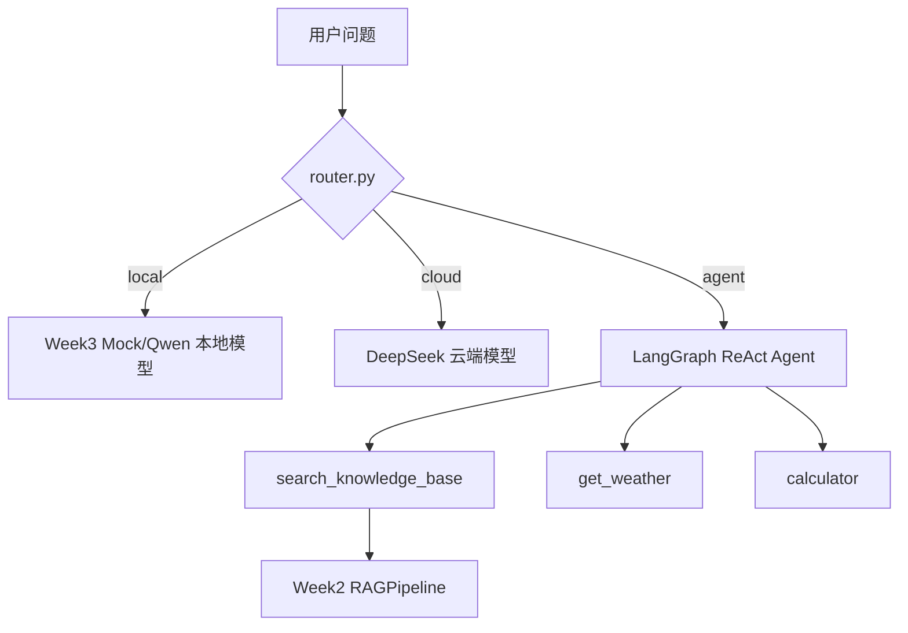

# 第4周：端云协同 + LangGraph ReAct Agent

← [路线图](../README.md) · [第一阶段（第 1–4 周）](../week1-4/) · **Week 4**

## 学习目标

完成本周学习后，你将能够：

- 设计端云协同路由策略（local / cloud / agent）
- 使用 LangGraph 构建 ReAct Agent
- 将第 2 周 RAG 封装为 Agent 工具
- 集成天气查询、计算器等工具
- 构建可演示的端云协同助手

## 本周资源

- [LangGraph 官方文档](https://langchain-ai.github.io/langgraph/)
- [LangGraph ReAct Agent 教程](https://langchain-ai.github.io/langgraph/tutorials/prebuilt/)
- 第 1-3 周代码：`week1/` `week2/` `week3/`

---

## 快速开始

```text
week4/
├── requirements.txt
├── router.py             # 端云路由
├── tools.py              # RAG / 天气 / 计算器
├── agent.py              # LangGraph Agent + 编排器
├── app.py                # 命令行演示
├── app_gradio.py         # Gradio 演示
└── verify_setup.py
```

### 1. 安装依赖

```bash
cd week4
pip install -r requirements.txt
```

### 2. 配置 API Key（cloud/agent 路径需要）

复用 `week1/.env` 或：

```bash
cp .env.example .env
```

### 3. 准备 Week 2 知识库（Agent 工具需要）

```bash
cd ../week2
python ingest.py --reindex
cd ../week4
```

### 4. 运行检查

```bash
python verify_setup.py
```

### 5. 运行演示

```bash
# 预览路由（无需 API Key）
python app.py --route-only "北京天气怎么样"

# 端侧路径（无需 API Key）
python app.py "你好"

# 完整演示（cloud/agent 需要 API Key）
python app.py
python app_gradio.py
```

---

## 架构概览



---

## 详细步骤

### Step 1: 端云路由设计

`router.py` 使用可解释的规则：

| 路由 | 触发条件 | 示例 |
|------|----------|------|
| `local` | 短问候、简单短句 | 「你好」 |
| `cloud` | 长文本、复杂分析词 | 「请分析微服务架构设计步骤」 |
| `agent` | 需要工具 | 「北京天气」「什么是 RAG」「计算 (12+8)*2」 |

预览路由：

```bash
python app.py --route-only "什么是 RAG？"
```

---

### Step 2: 工具封装

`tools.py` 提供三个工具：

1. **`search_knowledge_base`**：调用 `week2/rag_pipeline.py`
2. **`get_weather`**：调用 wttr.in 免费天气 API
3. **`calculator`**：安全数学表达式计算

---

### Step 3: LangGraph ReAct Agent

`agent.py` 使用：

```python
from langgraph.prebuilt import create_react_agent

agent = create_react_agent(cloud_llm, tools)
```

Agent 会自动决定调用哪个工具，并基于工具结果生成最终答案。

---

### Step 4: 端云编排器

`EdgeCloudOrchestrator` 统一入口：

```python
from agent import EdgeCloudOrchestrator

orchestrator = EdgeCloudOrchestrator(local_backend="mock")
result = orchestrator.run("北京现在天气怎么样？")
print(result.route, result.backend, result.answer)
```

返回字段：

- `route`：local / cloud / agent
- `reason`：路由原因
- `backend`：实际执行后端
- `answer`：最终回答

---

### Step 5: 命令行与 Gradio 演示

**命令行**：

```bash
python app.py "计算 (12 + 8) * 2"
```

**Gradio**：

```bash
python app_gradio.py
```

界面会显示路由决策、后端和回答，便于面试演示。

---

### Step 6: 端云协同最佳实践

1. **先路由再执行**：避免所有请求都打云端
2. **工具优先 Agent**：需要外部数据时走 Agent，而不是让 LLM 编造
3. **端侧兜底**：弱网时至少能完成问候和简单交互
4. **可观测性**：记录 `route` 和 `backend`，便于调试和优化

---

## 本周验收清单

- [ ] `python verify_setup.py` 通过
- [ ] `python app.py --route-only "你好"` 返回 `local`
- [ ] `python app.py "你好"` 走端侧并返回答案（无需 API Key）
- [ ] 配置 API Key 后，`python app.py "什么是 RAG？"` 能调用知识库工具
- [ ] `python app.py "北京天气怎么样"` 能返回天气信息
- [ ] `python app.py "计算 (12+8)*2"` 返回 40
- [ ] `python app_gradio.py` 可打开演示界面
- [ ] 能画图解释 local / cloud / agent 三者区别

---

## 常见问题

### 1. Agent 提示知识库不存在

```bash
cd ../week2 && python ingest.py --reindex
```

### 2. cloud/agent 路径报错 API Key

在 `week1/.env` 或 `week4/.env` 配置 `DEEPSEEK_API_KEY`。

### 3. 路由不符合预期

修改 `settings.py` 中 `LOCAL_KEYWORDS`、`AGENT_KEYWORDS`、`COMPLEX_KEYWORDS`。

### 4. Agent 响应慢

Agent 可能多次调用工具+LLM，属于正常现象。简单问题可优化路由规则走 `cloud` 或 `local`。

---

## 第一阶段总结

完成第 1-4 周后，你已经具备：

| 周次 | 能力 |
|------|------|
| Week 1 | LLM API + Prompt + Tool Use 入门 |
| Week 2 | RAG + FastAPI 服务化 |
| Week 3 | 端侧模型抽象 + Android 离线聊天骨架 |
| Week 4 | 端云协同 + LangGraph Agent |

这些能力将直接进入第二阶段项目实战（第 5-8 周）。

---

**最后更新**：2026 年 7 月
